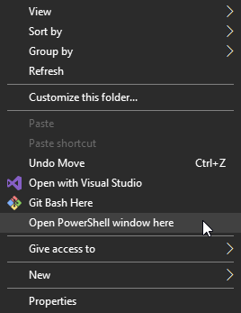

# OpenCVWrapper
The purpose of this wrapper is to provide an interface to the OpenCV library that can be dynamically linked to the LensCalibrator plugin. This interface is separate due to the following reasons:
1. Avoid the difficult build process compiling and linking OpenCV to a UE4 plugin directly.
2. To define a hard DLL boundary for converting and communicating data from UE4 -> OpenCV -> UE4.
3. To avoid CLR DLL boundary data corruption.

## Get Precompiled Build
You can download release build of this DLL [here](https://github.com/Polypulse/OpenCVWrapper/releases).

## Requirements
- Visual Studio 2019
- Latest MSVC
- Windows SDK latest

## Building
1. Hold shift and right click in explorer window of repository:



2. Execute ```./PullDependencies.ps1``` and wait for ThirdParty.zip to download and extract. If your having issues with this script, you can download and extract the file directory [here](https://github.com/Polypulse/OpenCVWrapper/releases).
3. Open OpenCVWrapper.sln
4. Select Debug or Release and press F7 to build.

## OpenCV Binaries
OpenCV needs to be compiled in a very specific way in order for it to play nicely with Unreal Engine. Therefore precompiled binaries can be found in the [releases](https://github.com/Polypulse/OpenCVWrapper/releases) page as *ThirdParty.zip*. However, if you need update OpenCV below will be some instructions on how to compile OpenCV for Unreal Engine.

TODO